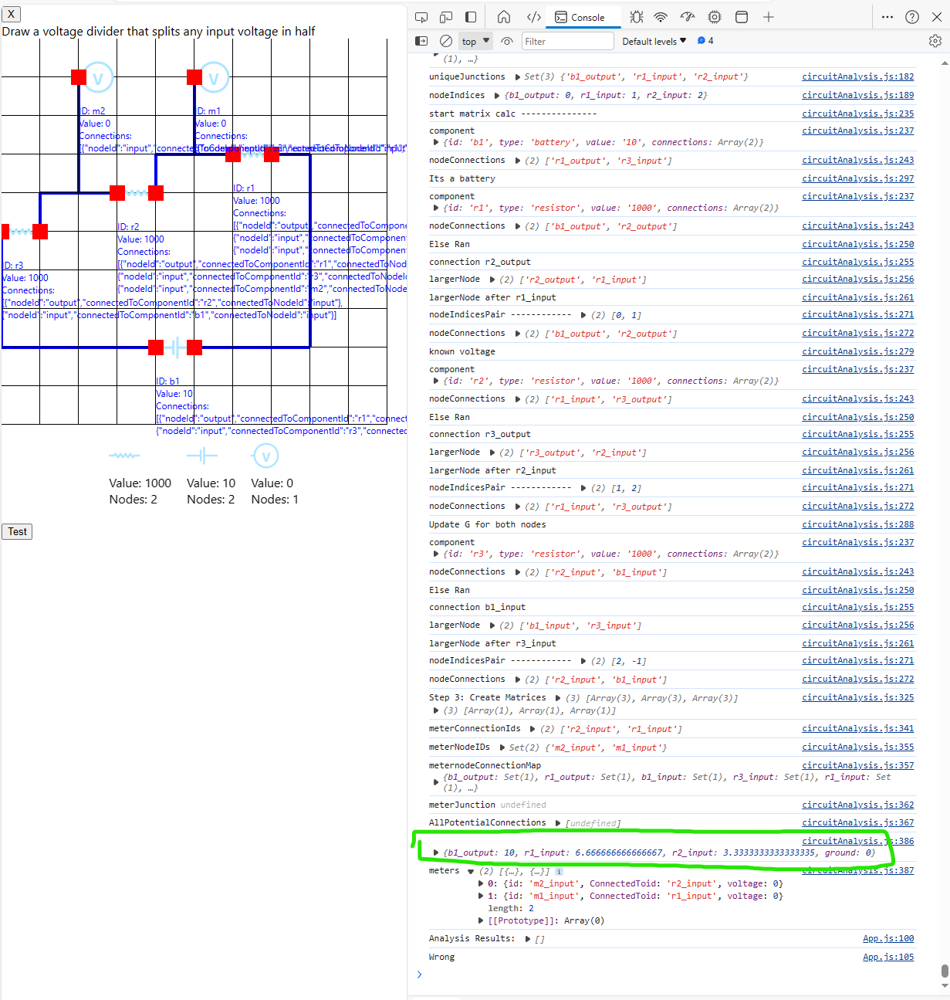
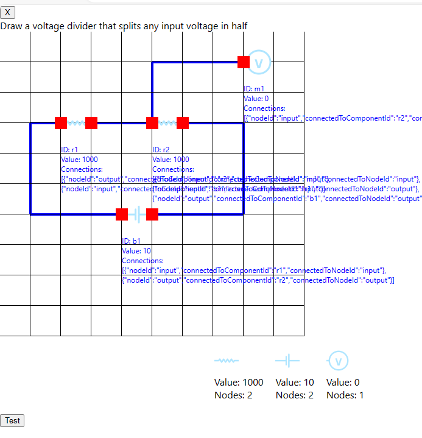
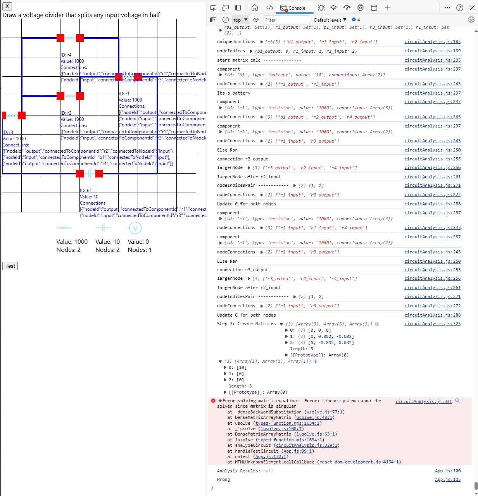
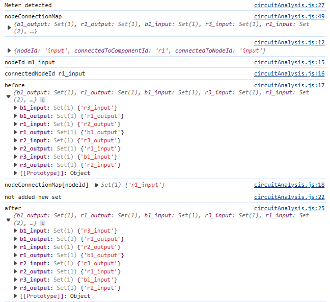

# Schematic Builder App

This project was bootstrapped with [Create React App](https://github.com/facebook/create-react-app).

### Goal:
Create a question and answer style app where you are asked to draw circuits, the app checks it and confirms it's correct or not.

### Current features:
- Drag resistors (worth 1kohm), batteries (10V) and a volt meter onto the grid
- Draw lines to connect them (do not duplicate connections)
- While drawing a line, click to set the current line in place and contiune drawing
- Double click to delete the line being drawn
- Press test to run circuitAnalysis to use modified nodal analysis to calculate the voltages. 
- Use the Voltmeter as the answer voltage and compare with the question.

## Working circuits
- Currently only serial resistor circuits with a single battery work. I can do a 2x resistor in series with a battery to half the input voltage. 

## Example CircuitData
This circuit works for MNA however, it is classed as incorrect because the meter is not being added to the dictionary in circuitAnalysis.js 


```text
circuitData = [
    {id: 'b1', type: 'battery', value: '10', connections: [
    {nodeId: 'output', connectedToComponentId: 'r1', connectedToNodeId: 'output'},
    {nodeId: 'input', connectedToComponentId: 'r2', connectedToNodeId: 'input'}
]},
{id: 'r1', type: 'resistor', value: '1000', connections: [
    {nodeId: 'output', connectedToComponentId: 'r1', connectedToNodeId: 'output'},
    {nodeId: 'input', connectedToComponentId: 'r2', connectedToNodeId: 'input'}
]},
{id: 'm1', type: 'meter', value: '0', connections: [{nodeId: 'input', connectedToComponentId: 'r1', connectedToNodeId: 'input'}]},
{id: 'r2', type: 'resistor', value: '1000', connections: [
    {nodeId: 'output', connectedToComponentId: 'r1', connectedToNodeId: 'input'},
    {nodeId: 'input', connectedToComponentId: 'b1', connectedToNodeId: 'input'}
]}
]
```
This circuit also works. It seems when the resistors are placed with the names (r1, r2,r3) in the right order, it works



However, when the resistors are flipped positions, it returns incorrect voltages:

b1_output
: 
9.990009990009991
ground
: 
0
r1_output
: 
-9990.00999000999



Parallel circuits dont seem to work:



## Known issues
- CircuitAnalysis is hit and miss with voltages. Sometimes it works.
- Volt Meters are failing to be added to nodeConnectionMap. Code is on line 19 in circuitAnalysis.js

- Duplicate connection can crash app.
- Double click should delete line but doesnt


----

Every componnt is a class with a constructor:
class resistor {
  constructor(
    id,
    label_id,
    inp_port_id,
    out_port_id,
    label,
    node_k,
    node_l,
    ele_code
  ) {
    this.id = id;
    this.label_id = label_id;
    this.inp_port_id = inp_port_id;
    this.out_port_id = out_port_id;
    this.label = label;
    this.node_k = node_k;
    this.node_l = node_l;
    this.ele_code = 1;
  }
}

class volt_src {
  constructor(
    id,
    label_id,
    inp_port_id,
    out_port_id,
    label,
    node_k,
    node_l,
    ele_code
  ) {
    this.id = id;
    this.label_id = label_id;
    this.inp_port_id = inp_port_id;
    // ## Here inp_port is the low
    this.out_port_id = out_port_id;
    // ## Here out_port is the high
    this.label = label;
    this.node_k = node_k;
    // ## The final node numbers to be used directly in our version 1 algo
    this.node_l = node_l;
    // ## The final node numbers to be used directly in our version 1 algo
    this.ele_code = 3;
  }
}

class connection {
  constructor(conn_id, label_id, label_text, src_node, tar_node) {
    this.conn_id = conn_id;
    this.label_id = label_id;
    this.label_text = label_text;
    this.src_node = src_node;
    this.tar_node = tar_node;
  }
}
