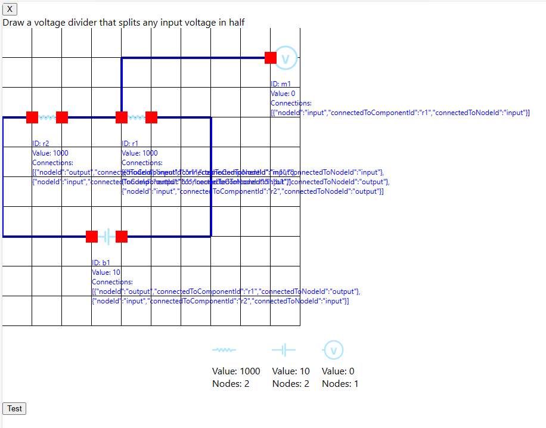

# Schematic Builder App

This project was bootstrapped with [Create React App](https://github.com/facebook/create-react-app).

### Goal:
Create a question and answer style app where you are asked to deaw circuits, the app checks it and confirms its correct or not.

### Current features:
- Drag resistors (worth 1kohm), batteries (10V) and a volt meter onto the grid
- Draw lines to connect them (do not duplicate connections)
- While drawing a line, click to set the current line in place and contiune drawing
- Double click to delete the line being drawn
- Press test to run circuitAnalysis to use modified nodal analysis to calculate the voltages. 
- Use the Voltmeter as the answer voltage and compare with the question.

## Working circuits
- Currently only serial resistor circuits with a single battery work. I can do a 2x resistor in series with a battery to half the input voltage. 

## Known issues
- CircuitAnalysis is hit and miss with voltages. Sometimes it works.
- Volt meter is missing from nodeConnectionMap
- Duplicate connection can crash app.
- Double click should delete line but doesnt

## Example CircuitData
This circuit works for MNA however, it is classed as incorrect because the meter is not being added to the dictionary in circuitAnalysis.js 



```text
circuitData = [
    {id: 'b1', type: 'battery', value: '10', connections: [
    {nodeId: 'output', connectedToComponentId: 'r1', connectedToNodeId: 'output'},
    {nodeId: 'input', connectedToComponentId: 'r2', connectedToNodeId: 'input'}
]},
{id: 'r1', type: 'resistor', value: '1000', connections: [
    {nodeId: 'output', connectedToComponentId: 'r1', connectedToNodeId: 'output'},
    {nodeId: 'input', connectedToComponentId: 'r2', connectedToNodeId: 'input'}
]},
{id: 'm1', type: 'meter', value: '0', connections: [{nodeId: 'input', connectedToComponentId: 'r1', connectedToNodeId: 'input'}]},
{id: 'r2', type: 'resistor', value: '1000', connections: [
    {nodeId: 'output', connectedToComponentId: 'r1', connectedToNodeId: 'input'},
    {nodeId: 'input', connectedToComponentId: 'b1', connectedToNodeId: 'input'}
]}
]
```
